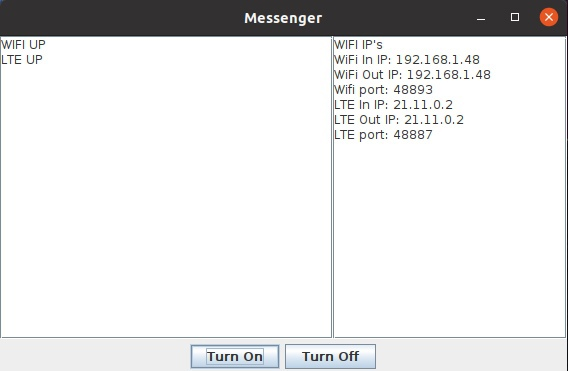
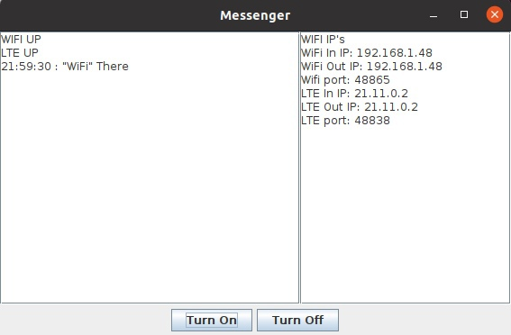
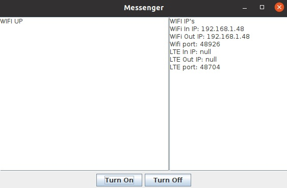

# LTE-UserDevice-
This application is designed to receive messages from multiple interfaces.

- Requirments:
  - For correct work you need to install JDK 14 or higher. To install it on linux follow next commands:
  - In the command line, write the commands to install java14:
    sudo apt install openjdk-14-jre-headless
    sudo apt install openjdk-14-jdk-headless
- On Linux, the application can be run using the scrpits. To do this, first write next commands in the command lime from directory with file compile.sh:
  - sh ./compile.sh
  - sh ./start.sh 
- On Windows, you can also run the application through a script. To do this, you need to register compile in the console.bat, then start.bat
- Default result of running this commands will be opened window with name "Messenger" on top. And two buttons "Turn On" and "Turn Off". After you press button "Turn On" in the center part of the window will be written names of interfaces which is work on your PC. On the right side of screen should be printed service info, which contains network interface's IP and number of port.
- Detailed information about classes, methods, field you can get in javadoc directory of git.
- Example of the case when user have two inerfaces on his PC and press "Turn On" button. If output looks like on next picture, it means that both interfaces work correct. After that user can get messages.
-
- Example of the case when user have two inerfaces on his PC and press "Turn Off" button. If output looks like on next picture, it means that both interfaces were off and now user can't get any messages.
-
- Example of the case when user gets message. (From left to right) First it is date when message arrives. Second it is name of the interface, which was used to send this message. Third text of the message.
-
- Troubleshoot 
  - __On Windows, problems may occur if the JAVA_HOME variable is not registered in the system. In this case, it is necessary in the compile file.bat specify the path to javac.__
  - If you get output info like on the next picture. And for example LTE IP is null. It means that you don't connect to that interface.
  - 
